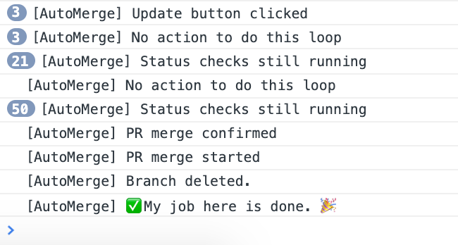

# github-auto-merge
**Browser script to smash the Update + Merge button until the PR is merged**

## Installation instructions:

1. Grab [Tampermonkey for Chrome](https://chrome.google.com/webstore/detail/tampermonkey/dhdgffkkebhmkfjojejmpbldmpobfkfo//Open)
2. Open the dashboard and go to Utilities
3. Enter the URL: `https://raw.githubusercontent.com/krivachy/github-auto-merge/master/automerge.js` and click import
4. Add the following bookmarklet to invoke the AutoMerge: `javascript:(function() {window.autoMerge();})();`

## Usage

1. Click on the bookmarklet and keep your Chrome tab open. The next time you look back it will be merged!
2. Monitor the progress in your JS console.

## Caveats

* Only works for "Squash + rebase" style PRs for now (intended for certain manifest repos)
* Depends on DOM elements + CSS selectors, so if Github changes things this will break.

## Contributions

Much welcome! Please submit a PR, especailly if you want to add support for other merge strategies.
